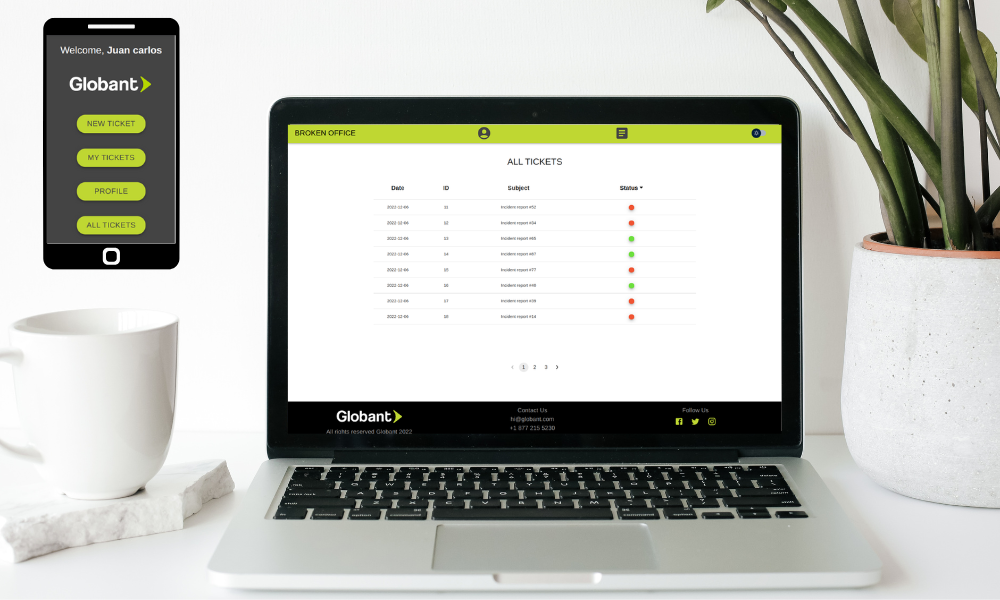

<a name="readme-top"></a>
[![Contributors][contributors-shield]][contributors-url]
[![Issues][issues-shield]][issues-url]

<!-- PROJECT LOGO -->
<br />
<div align="center">
  <a href="https://github.com/Merssith/BrokenOffice-Front">
    
  </a>

<h3 align="center">FRONTEND GLOBANT BROKEN OFFICE</h3>

  <p align="center">
    <br />
    <a href="https://github.com/Merssith/BrokenOffice-Front"><strong>Explore the docs »</strong></a>
    <br />
    <a href="https://github.com/Merssith/BrokenOffice-Back"><strong>Backend Repository</strong></a>
    <br />
    <a href="https://github.com/Merssith/BrokenOffice-Front/issues">Report bug</a>
    ·
    <a href="https://github.com/Merssith/BrokenOffice-Front/issues">Request feature</a>
  </p>
</div>

<!-- TABLE OF CONTENTS -->
<details>
  <summary>Table of Contents</summary>
  <ol>
    <li>
      <a href="#about-the-proyect">About The Project</a>
      <ul>
        <li><a href="#built-with">Built With</a></li>
      </ul>
    </li>
    <li>
      <a href="#getting-started">Getting Started</a>
      <ul>
        <li><a href="#prerequisites">Prerequisites</a></li>
        <li><a href="#installation">Installation</a></li>
      </ul>
    </li>
    <li><a href="#usage">Usage</a></li>
    <li><a href="#roadmap">Roadmap</a></li>
    <li><a href="#contributing">Contributing</a></li>
    <li><a href="#contact">Contact</a></li>
  </ol>
</details>

<!-- ABOUT THE PROJECT -->

## About The Proyect

<p align="center"></p>

Mobile first application that allows reporting problems and damaged items in the offices or homes of globers using geolocation, machine learning and other technologies to make the experience as simple as possible.

<p align="right">(<a href="#readme-top">back to top</a>)</p>

### Built With

- React
- Redux
- Axios
- MaterialUi
- Google Maps

<p align="right">(<a href="#readme-top">back to top</a>)</p>

<!-- GETTING STARTED -->

## Getting Started

This FrontEnd is connected to a Backend, necessary to be able to use the application.

### Prerequisites

You must meet the following pre-requisites to be able to use this project

- Start the [backend server](https://github.com/Merssith/BrokenOffice-Back)

### Installation

1. Clone the repo
   ```sh
   git clone https://github.com/Merssith/BrokenOffice-Front.git
   ```
2. Install NPM packages
   ```sh
   npm install
   ```
3. Run the APP
   ```sh
   npm start
   ```

<p align="right">(<a href="#readme-top">back to top</a>)</p>

<!-- API  -->

## Usage

<p>USAGE EXAMPLE HERE</p>

<!-- ROADMAP -->

## Roadmap

- [x] Features for all users
  - [x] Sign up
  - [x] Login/Logout
  - [x] Session persistence
  - [x] Incident creation
  - [x] Incident history
  - [x] User profile
- [x] Admin features
  - [x] Assigned incidents
  - [x] Resolve incidents or change status
  - [x] Start chat
- [x] Super Admin features
  - [x] See all incidents
  - [x] See all users
  - [x] Manage users
- [x] Additional features
  - [x] Geolocation for all users and incidents
  - [x] Machine Learning for incidents
  - [x] Auto assignment of incidents to the closest administrator
  - [x] Chat
  - [x] Backend monitoring
  - [x] Email service

<p align="right">(<a href="#readme-top">back to top</a>)</p>

<!-- CONTRIBUTING -->

## Contributing

<p>Contributions from the Dev community help us learn, be inspired, and create new things! All contributions are welcome!</p>
<p>If you have any suggestions to improve our project, please fork the repository and create a pull request. Or You can also simply open an issue.</p>
<p>Thanks again!</p>

1. Fork the Project
2. Create your Feature Branch (`git checkout -b feature/MyFeature`)
3. Commit your Changes (`git commit -m 'Add MyFeature'`)
4. Push to the Branch (`git push origin feature/MyFeature`)
5. Open a Pull Request

<p align="right">(<a href="#readme-top">back to top</a>)</p>

<!-- CONTACT -->

## Contact

- Mercedes Salcedo » [Email](mercedes.salcedo1989@gmail.com) - [LinkedIn](https://www.linkedin.com/in/mercedessalcedojobs/)
- Patricio Imbrogno » [Email](patricioimbrogno@gmail.com) - [LinkedIn](https://www.linkedin.com/in/patricio-imbrogno)
- Rodrigo Escalera » [Email](roescal347@gmail.com) - [LinkedIn](https://www.linkedin.com/in/rodrigo-escalera-a00a97252/)
- Juan Manuel Arias » [Email](juanmaariasrodriguez@gmail.com) - [LinkedIn](https://www.linkedin.com/in/juan-manuel-arias-rodriguez/)
- Leandro Echezuri » [Email](leandro.echezuri@gmail.com) - [LinkedIn](https://www.linkedin.com/in/leandro-echezuri-671b58233/)

Project Link: [https://github.com/Merssith/BrokenOffice-Front](https://github.com/Merssith/BrokenOffice-Front)

<p align="right">(<a href="#readme-top">back to top</a>)</p>

[contributors-shield]: https://img.shields.io/github/contributors/Merssith/BrokenOffice-Front.svg?style=for-the-badge
[contributors-url]: https://github.com/Merssith/BrokenOffice-Front/graphs/contributors
[issues-shield]: https://img.shields.io/github/issues/Merssith/BrokenOffice-Front.svg?style=for-the-badge
[issues-url]: https://github.com/Merssith/BrokenOffice-Front/issues
